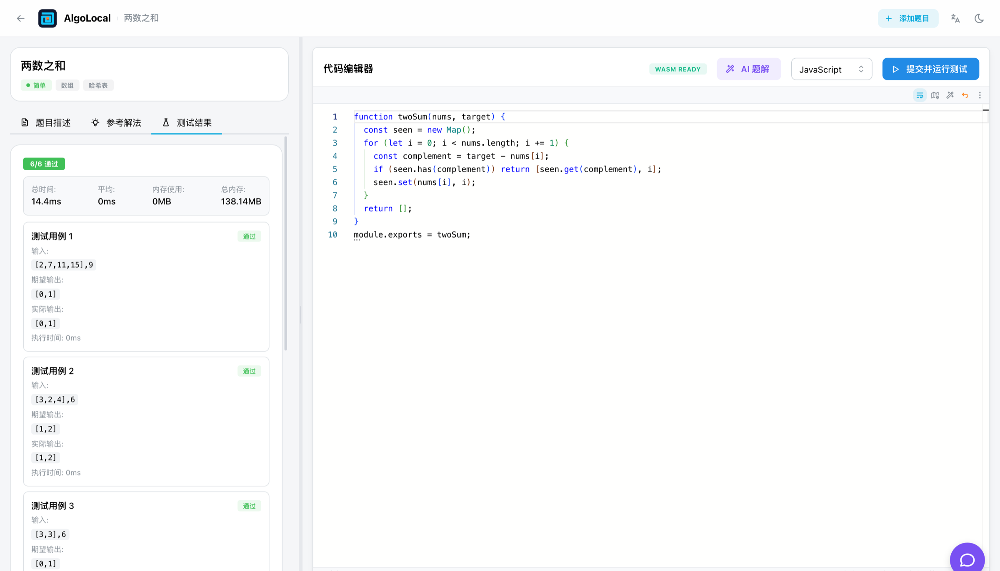
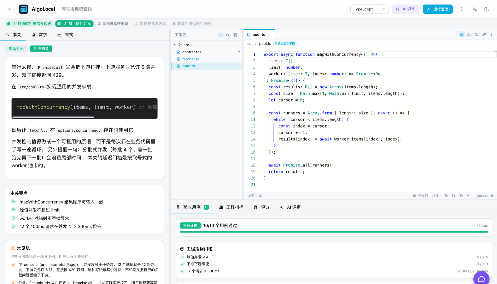

# AlgoLocal

[English](./README.md) | [Español](./README.es-ES.md)

快速链接: [讨论区](https://github.com/zxypro1/algolocal/discussions) | [Issues](https://github.com/zxypro1/algolocal/issues) | [Pull Requests](https://github.com/zxypro1/algolocal/pulls)

> 完全跑在自己机器上的编程练习。用 JavaScript、TypeScript 或 Python 刷 LeetCode（力扣）风格的算法题，再进工程实战：多关卡的真实项目，按并发度、延迟、容错和代码质量评审。AI 可选、服务商自选，不用注册也不用联网。





## 快速开始

### 桌面应用

不用装环境也不用配置，下载下来就能跑。

[下载最新版本](https://github.com/zxypro1/algolocal/releases/latest)

| 平台 | 下载文件 |
|------|----------|
| macOS (Apple Silicon) | `AlgoLocal-*-macOS-arm64.dmg` |
| macOS (Intel) | `AlgoLocal-*-macOS-x64.dmg` |
| Windows (安装版) | `AlgoLocal-*-Windows-Setup.exe` |
| Windows (便携版) | `AlgoLocal-*-Windows-Portable.exe` |
| Linux (AppImage) | `AlgoLocal-*-Linux.AppImage` |
| Linux (Debian/Ubuntu) | `AlgoLocal-*-Linux.deb` |
| Linux (Fedora/RHEL) | `AlgoLocal-*-Linux.rpm` |

macOS 如果提示「应用已损坏，无法打开」，在终端里清掉隔离属性：
```bash
xattr -cr "/Applications/AlgoLocal.app"
```

### 从源码运行

见下面的[本地运行](#本地运行)。

## 功能特性

两种练法。算法题是熟悉的那种，面试前在力扣上刷的就是它：读题、写函数、跑用例。工程实战是另一半，下面单独讲，你在多文件工作区里分关卡搭一个小系统，评的是并发度、延迟、容错和代码本身好不好读。

所有东西都在你自己机器上跑。初次配置之后不需要联网，代码通过 WebAssembly 在浏览器里执行，练习记录存在本地而不是别人的服务器上。AI 想用的时候在，不用的时候不打扰。

编辑器用的是 Monaco（VS Code 同款），有语法高亮和补全，草稿按「题目 + 语言」分别保存。数据看板记录你做过什么、什么时候做的，按难度和标签给出正确率，还有每日活跃热力图和最近的尝试记录。内置 29 道题，也可以自己加。

Windows、macOS、Linux 都支持。

### 语言

| 语言 | 怎么跑的 |
|------|----------|
| JavaScript | 浏览器原生执行 |
| TypeScript | 先用 TypeScript 编译器转译再执行 |
| Python | Pyodide，编译成 WebAssembly 的 CPython |

没有任何服务端执行。

### AI 能做什么

四个功能共用一份服务商配置，key 配一次就够。

题目生成器接受一句大白话描述，产出完整题目：题面、含边界的测试用例、初始模板和参考解法。题解生成器针对卡住的题给出多种解法，从暴力到最优，每种都标了复杂度和取舍。聊天助手基于你已经写出来的代码答疑，不会直接把答案塞给你。工程评审则像评审生产环境的 PR 一样，对通关后的实现提意见。

可以接 DeepSeek、OpenAI、Claude、Qwen 或本地 Ollama，随时切换。详见 [AI_PROVIDER_GUIDE.md](./AI_PROVIDER_GUIDE.md)。

## 工程实战

算法题只问「函数对不对」。工程实战问的是决定代码能不能上线的问题：并发下还对不对、延迟守不守得住、
下游挂了会怎样、半年后别人能不能维护。

一道工程题是一个需要分阶段构建的小系统，你在完整的多文件工作区里写代码：

- 文件树、多标签 Monaco 编辑器、只读契约文件，后面的文件随关卡解锁
- 每一关只引入一个工程关注点，通关后解锁下一关
- 隐藏的验收用例，外加基于真实度量的工程指标门槛（「峰值并发 ≤ 4」「12 个请求 300ms 内完成」）
- 虚拟时钟：`sleep(200)` 不花真实时间，但延迟与并发度照样被精确、可复现地量出来
- 按正确性、并发度、延迟、容错性、封装、优雅程度六个维度评分
- AI 评审会结合你的代码、运行结果与静态指标，像评审生产环境的 PR 那样给意见
- AI 生成题目：描述你想练的能力，生成出来的题目要先跑通自己的参考实现才会入库

内置三个项目：高可用抓取管线（并发池、指数退避、缓存单飞、取消）、事件驱动的订单流水线（事件总线、
洋葱中间件、幂等、死信队列）、有韧性的 API 网关（令牌桶、熔断器、超时预算）。

想自己出题，见 [工程实战指南](./ENGINEERING-PRACTICE-GUIDE.md)。

## 怎么用

从列表里挑一道题，选好语言，在编辑器里写。点「提交并运行测试」在浏览器里跑，每条用例的结果和耗时都会列出来。卡住了就用 AI 聊天，它看得到你写的代码；想看完整思路再让 AI 题解写出几种解法。做过的题会进数据看板。

工程实战这边，打开一个项目，左边读本关要求，中间写代码，点「运行验收」。你会拿到用例结果、实测指标、工程门槛、六个维度的评分，需要的话还有一份 AI 评审。通关之后下一关解锁。

想生成题目就打开 AI 生成器，描述你想练什么，比如「二叉搜索树」或者「带最优子结构的动态规划」，生成的题目直接进题库。

AI 服务商在设置页配：桌面端点「设置」按钮或应用菜单，浏览器里访问 `/settings`。桌面端的配置写在 `~/.offline-leet-practice/config.json`。

加题目有三条路：应用内的「添加题目」页面、粘贴或上传 JSON、直接改 `public/problems.json`。格式见 [MODIFY-PROBLEMS-GUIDE.md](./MODIFY-PROBLEMS-GUIDE.md)。

## 本地运行

需要 Node.js 18 以上（[下载](https://nodejs.org/)）和 npm 8 以上。

Windows：
```bash
start-local.bat
```

macOS 和 Linux：
```bash
chmod +x start-local.sh
./start-local.sh
```

或者手动来：
```bash
git clone https://github.com/zxypro1/algolocal.git
cd algolocal
npm install
npm run build
npm start
```

然后在浏览器中打开 http://localhost:3000。

### 构建桌面应用

```bash
# macOS
npm run dist:mac

# Windows
npm run dist:win

# Linux
npm run dist:linux

# 所有平台
npm run dist:all
```

细节见 [DESKTOP-APP-GUIDE-zh.md](./DESKTOP-APP-GUIDE-zh.md)。

## 技术栈

React 18 + Next.js 13（TypeScript），界面用 Mantine v7，编辑器是 Monaco，桌面端用 Electron 打包。代码执行走 WebAssembly：JavaScript 用浏览器的 `Function` 构造器，TypeScript 先经 TypeScript 编译器转译，Python 跑在 Pyodide 上。

## 项目结构

```
algolocal/
├── pages/                  # Next.js 页面和 API 路由
│   ├── api/
│   │   ├── problems.ts     # 题目数据 API
│   │   ├── generate-problem.ts  # AI 题目生成
│   │   ├── ai-solution.ts  # AI 题解生成
│   │   ├── ai-chat.ts      # AI 聊天助手
│   │   ├── add-problem.ts
│   │   └── ...
│   ├── projects/           # 工程实战：列表、工作区、生成器
│   ├── problems/[id].tsx   # 题目详情页面（带 AI 聊天 + AI 题解）
│   ├── generator.tsx       # AI 生成器页面
│   ├── stats.tsx           # 练习数据看板页面
│   ├── manage.tsx          # 题目管理页面
│   └── index.tsx           # 首页
├── src/
│   ├── components/         # React 组件
│   │   ├── PracticeDashboard.tsx  # 统计数据可视化
│   │   ├── ContributionHeatmap.tsx
│   │   └── ...
│   ├── hooks/
│   │   ├── useWasmExecutor.ts
│   │   └── useProjectRunner.ts   # 在 Web Worker 里运行一关
│   ├── lib/
│   │   ├── practiceStats.ts  # 本地统计追踪
│   │   └── engineering/      # 虚拟时钟、lab、模块运行时、用例框架、评分
│   └── workers/
│       └── projectRunner.worker.ts
├── projects/
│   ├── definitions/        # 工程实战题目源文件（编译成 projects.json）
│   └── projects.json
├── public/
│   ├── problems.json       # 题目数据库
│   └── projects.json       # 工程实战题库
├── electron-main.js        # Electron 主进程
└── electron-builder.config.js
```

## 贡献

欢迎参与。最有用的是补充算法题和工程实战项目；数据分析、界面和文档的改进同样欢迎。

## 许可证

MIT License

---

随时随地练：飞机上、游轮上、内网办公环境，或者任何没网的地方。
