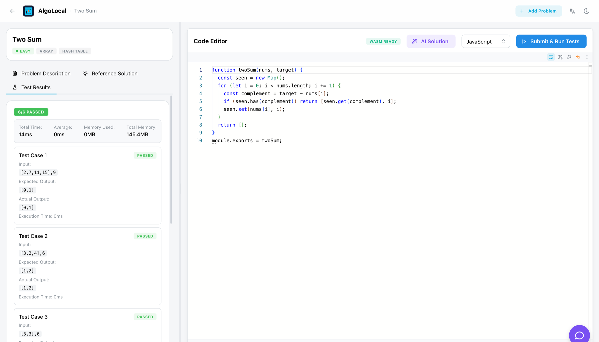
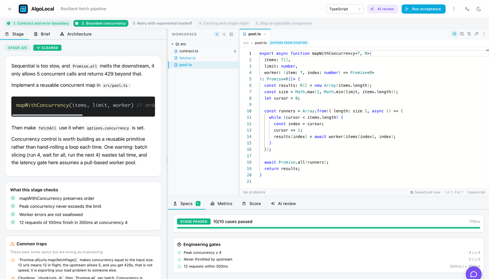

<div align="center">


# AlgoLocal

**Offline coding practice, from LeetCode-style problems to real engineering projects.**

<p>
  <a href="https://github.com/zxypro1/algolocal/releases/latest"></a>
  <a href="https://github.com/zxypro1/algolocal/releases"></a>
  <a href="https://github.com/zxypro1/algolocal/stargazers"></a>
  
  
</p>

[中文](./README-zh.md) &nbsp;·&nbsp; [Español](./README.es-ES.md) &nbsp;·&nbsp; [Website](https://zxypro1.github.io/algolocal/) &nbsp;·&nbsp; [Discussions](https://github.com/zxypro1/algolocal/discussions) &nbsp;·&nbsp; [Issues](https://github.com/zxypro1/algolocal/issues)

</div>

<br />

Solve LeetCode-style algorithm problems in JavaScript, TypeScript or Python, then build multi-stage engineering projects that are graded on concurrency, latency, resilience and code quality. Everything runs on your own machine; AI assistance is optional and uses the provider you configure.



## Quick start

### Desktop application

No runtime dependencies are required. [Download the latest release](https://github.com/zxypro1/algolocal/releases/latest):

| Platform | Artifact |
|---|---|
| macOS (Apple Silicon) | `AlgoLocal-*-macOS-arm64.dmg` |
| macOS (Intel) | `AlgoLocal-*-macOS-x64.dmg` |
| Windows (Installer) | `AlgoLocal-*-Windows-Setup.exe` |
| Windows (Portable) | `AlgoLocal-*-Windows-Portable.exe` |
| Linux (AppImage) | `AlgoLocal-*-Linux.AppImage` |
| Linux (Debian, Ubuntu) | `AlgoLocal-*-Linux.deb` |
| Linux (Fedora, RHEL) | `AlgoLocal-*-Linux.rpm` |

If macOS reports that the application is damaged, clear the quarantine attribute:

```bash
xattr -cr "/Applications/AlgoLocal.app"
```

### From source

Requires Node.js 18 or later and npm 8 or later.

```bash
git clone https://github.com/zxypro1/algolocal.git
cd algolocal
npm install
npm run build
npm start
```

The application is then available at http://localhost:3000. `start-local.bat` (Windows) and `start-local.sh` (macOS, Linux) perform the same steps and offer to write an AI configuration file on first run.

## Contents

- [Quick start](#quick-start)
- [Features](#features)
- [Practice modes](#practice-modes)
- [Workshop](#workshop)
- [Problem market](#problem-market)
- [Language support](#language-support)
- [AI features](#ai-features)
- [Usage](#usage)
- [Development](#development)
- [Project structure](#project-structure)
- [Documentation](#documentation)

## Features

| Capability | Detail |
|---|---|
| Two practice modes | Algorithm problems and multi-stage engineering projects |
| Offline execution | Code runs in the browser through WebAssembly, with no server-side execution |
| Local data | Problems, drafts and statistics stay in local storage |
| Optional AI | Problem generation, hints, solutions and engineering review, via your own provider |
| Editor | Monaco, with per-problem and per-language draft persistence |
| Dashboard | Accuracy by difficulty and tag, activity heatmap, recent attempts |
| Workshop | Write, verify and publish your own problems, with an AI toolchain |
| Problem market | Optional. Download and share problems once you have an account. |
| Platforms | Windows, macOS, Linux |

## Practice modes

### Algorithm problems

Standard interview-style practice: read the statement, implement the function, run the test cases. 29 problems are included and the library is extensible.

### Engineering practice

A project is a small system built across several stages in a multi-file workspace. Correctness is necessary but not sufficient; each stage also measures behaviour.



| Component | Description |
|---|---|
| Workspace | File tree, tabbed editor, read-only contract files, files unlocked per stage |
| Acceptance specs | Hidden test cases, executed in a Web Worker |
| Engineering gates | Assertions on measured metrics, for example peak concurrency at most 4, or 12 requests within 300ms |
| Virtual clock | `sleep(200)` costs no real time while latency and concurrency remain exactly measurable |
| Scoring | Correctness, concurrency, latency, resilience, encapsulation, elegance |
| AI review | Reads the code, the latest run and the static metrics, then reviews it as a production pull request |

Three projects are included:

| Project | Topics |
|---|---|
| Resilient fetch pipeline | Bounded concurrency, backoff, single-flight caching, cancellation |
| Event-driven order pipeline | Event bus, onion middleware, idempotency, dead letter queue |
| Resilient API gateway | Token bucket, circuit breaker, timeout budgets |

Projects can also be generated by AI. A generated project is executed against its own reference solution before it is accepted. See the [Engineering Practice Guide](./ENGINEERING-PRACTICE-GUIDE.md) for the authoring format.

## Workshop

The workshop is where problems get written. It edits both kinds: algorithm problems as a form
over statement, templates, reference solution and test cases; engineering projects stage by
stage, down to the hidden specs and metric gates.

| Step | What happens |
|---|---|
| Draft | Start blank, fork something from your library, or import JSON. Drafts stay in the browser. |
| Assist | Polish the statement, fill in translations, propose test cases, write a reference solution, review the whole thing |
| Verify | Run the reference solution against the test cases; for a project, run every stage and confirm the starter skeleton fails |
| Deliver | Save into your local library, or publish to the market |

Verification is the part that matters. A problem whose tests disagree with its own reference
solution looks fine until somebody tries to solve it, and that is the failure the workshop is
built to catch before anyone else sees it.

The whole workshop works offline. Drafts are local, verification runs on your machine, and the
AI assistant uses whichever provider you configured, including a local one through Ollama. Only
publishing needs the network.

## Problem market

Optional, and off the critical path. Browse what other people have written, download it into
your local library, and publish your own. An account is needed to publish or star; downloading
is not.

| Capability | Needs an account |
|---|---|
| Browse and search | No |
| Download into your library | No |
| Star | Yes |
| Publish and update | Yes |

Sign in with an email and password, or with GitHub. Everything else in AlgoLocal keeps working
whether or not you ever create one: with the market unreachable, the market page says so and
the rest of the application is untouched.

Running your own backend takes a Postgres database and two environment variables. See the
[Cloud Deployment Guide](./CLOUD-DEPLOYMENT-GUIDE.md).

## Language support

| Language | Execution |
|---|---|
| JavaScript | Native browser execution |
| TypeScript | Transpiled by the TypeScript compiler, then executed |
| Python | Pyodide (CPython compiled to WebAssembly) |

## AI features

All four features share a single provider configuration.

| Feature | Description |
|---|---|
| Problem generator | Produces a complete problem from a natural-language description: statement, test cases, templates, reference solution |
| Solution generator | Produces several approaches with complexity analysis and trade-offs |
| Chat assistant | Answers questions about the code currently in the editor without revealing the full solution |
| Engineering review | Reviews a completed stage on concurrency safety, failure behaviour, module boundaries and style |

Supported providers: DeepSeek, OpenAI, Claude, Qwen, and local models through Ollama. See [AI_PROVIDER_GUIDE.md](./AI_PROVIDER_GUIDE.md).

## Usage

Algorithm problems:

1. Select a problem and a language.
2. Implement the solution in the editor.
3. Select "Submit & Run Tests" to execute the test cases in the browser.
4. Review the results, execution time, and the dashboard statistics.

Engineering projects:

1. Open a project and read the stage brief.
2. Implement the stage in the workspace.
3. Select "Run acceptance" to execute the hidden specs and evaluate the gates.
4. Review the spec results, metrics, score and optional AI review. Clearing a stage unlocks the next one.

Configuration and problem management:

- AI providers are configured in Settings (application menu in the desktop app, `/settings` in the browser). Desktop configuration is stored in `~/.offline-leet-practice/config.json`.
- Problems can be added through the "Add Problem" page, by importing JSON, or by editing `public/problems.json`. See [MODIFY-PROBLEMS-GUIDE.md](./MODIFY-PROBLEMS-GUIDE.md).

## Development

| Command | Purpose |
|---|---|
| `npm run dev` | Development server |
| `npm run build` | Production build |
| `npm run test:engineering` | Engineering runtime and preset project tests |
| `npm run test:ai` | Provider, streaming and JSON extraction tests |
| `npm run test:editor` | Draft persistence tests |
| `npm run test:workshop` | Problem validation, draft storage and starter template solvability |
| `npm run test:cloud` | Accounts, the market, repository parity and the offline guarantee |
| `npm run db:migrate` | Create or update the cloud database schema |
| `npm run smoke:cloud <url>` | Run a full publish-and-delete cycle against a deployment |
| `npm run projects:build` | Compile `projects/definitions` into `projects.json` |
| `npm run projects:verify` | Execute every stage against its reference solution |
| `npm run dist:mac` / `dist:win` / `dist:linux` / `dist:all` | Desktop builds, see [DESKTOP-APP-GUIDE.md](./DESKTOP-APP-GUIDE.md) |

Built with React 18, Next.js 13, TypeScript, Mantine v7, Monaco Editor and Electron.

## Project structure

```
algolocal/
├── pages/
│   ├── api/                    # Problem, AI and project endpoints
│   ├── problems/[id].tsx       # Problem detail, with AI chat and solutions
│   ├── cloud/                  # Account and problem market pages
│   ├── workshop/               # Problem authoring
│   ├── projects/               # Engineering Practice: list, workspace, generator
│   ├── generator.tsx           # AI problem generator
│   ├── stats.tsx               # Practice dashboard
│   ├── manage.tsx              # Problem management
│   └── index.tsx               # Problem list
├── src/
│   ├── components/             # React components
│   ├── hooks/                  # WASM executor, project runner, AI configuration
│   ├── lib/engineering/        # Virtual clock, lab, module runtime, spec runner, scoring
│   ├── lib/cloud/              # Cloud client: address resolution, session, offline handling
│   ├── lib/workshop/           # Problem model, validation, drafts
│   ├── lib/server/             # AI provider, project store, prompts
│   ├── lib/server/cloud/       # Accounts, market, repositories, migrations
│   └── workers/                # Stage runner worker
├── projects/definitions/       # Engineering project sources
├── public/
│   ├── problems.json           # Problem database
│   └── projects.json           # Engineering project database
├── electron-main.js
└── electron-builder.config.js
```

## Documentation

| Document | Contents |
|---|---|
| [ENGINEERING-PRACTICE-GUIDE.md](./ENGINEERING-PRACTICE-GUIDE.md) | How the engineering runtime works and how to author projects |
| [AI_PROVIDER_GUIDE.md](./AI_PROVIDER_GUIDE.md) | Provider configuration, models, troubleshooting |
| [MODIFY-PROBLEMS-GUIDE.md](./MODIFY-PROBLEMS-GUIDE.md) | Problem format and offline editing |
| [CLOUD-DEPLOYMENT-GUIDE.md](./CLOUD-DEPLOYMENT-GUIDE.md) | Running the optional backend, and its test system |
| [DESKTOP-APP-GUIDE.md](./DESKTOP-APP-GUIDE.md) | Desktop build and packaging |

## Contributing

Contributions are welcome. Additional algorithm problems and engineering projects are the most useful additions; improvements to the analytics, interface and documentation are equally welcome.

## License

MIT
